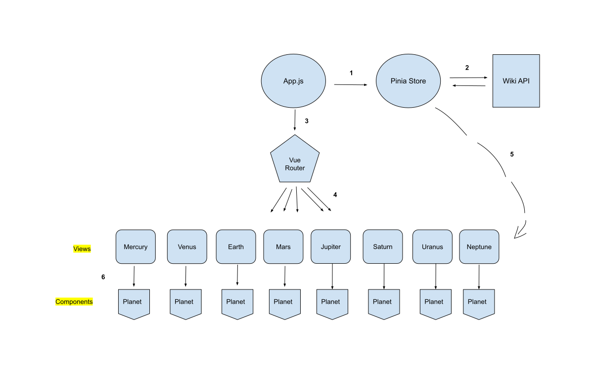

# Planet Facts

A beautiful responsive website to display facts about all the planets in our universe.
Mobile friendly, and queries all data from the Wikipedia API.

**LIVE DEMO:** <a href="https://planets-proj.vercel.app/" target="_blank">https://planets-proj.vercel.app/</a>


* **Development Tools:** <a href="https://code.visualstudio.com/" target="_blank">VSCODE</a>, <a href="https://git-scm.com/" target="_blank">git</a>, <a href="https://github.com/" target="_blank">github</a>, <a href="https://ubuntu.com/tutorials/command-line-for-beginners#1-overview" target="_blank">Linux CLI</a>, <a href="https://www.gnu.org/software/bash/" target="_blank">bash</a>, <a href="https://www.npmjs.com/" target="_blank">npm</a>, <a href="https://eslint.org/" target="_blank">eslint</a>, <a href="https://prettier.io/" target="_blank">Prettier</a>

* **Frameworks & Languges:** <a href="https://vuejs.org/" target="_blank">Vue js 3</a> (<a href="https://vuejs.org/guide/extras/composition-api-faq.html" target="_blank">Compositions API</a>), <a href="https://www.typescriptlang.org/" target="_blank">Typescript</a>, <a href="https://css-tricks.com/snippets/css/a-guide-to-flexbox/" target="_blank">Flexbox</a>, <a href="https://nodejs.org/en/" target="_blank">Node js</a>

* **Libraries & APIs:** <a href="https://tailwindcss.com/docs/installation" target="_blank">Tailwindcss</a>, <a href="https://router.vuejs.org/" target="_blank">Vue Router</a>, <a href="https://axios-http.com/" target="_blank">Axios</a>, <a href="https://vitejs.dev/" target="_blank">Vite</a>, <a href="https://postcss.org/" target="_blank">postcss</a>, <a href="https://cheerio.js.org/" target="_blank">Cheerio</a>, <a href="https://pinia.vuejs.org/" target="_blank">Pinia</a>, <a href="https://en.wikipedia.org/api/rest_v1/#/" target="_blank">Wikipedia REST API</a>, <a href="https://vercel.com" target="_blank">Vercel</a>

## Features

✅ Responsive at every size \
✅ No hard coded width containers or assets \
✅ Beautiful async/await code syntax \
✅ Clean & organized code that allows anyone to collaborate easily \
✅ Queries all text from Wikipedia API \
✅ Seamless navigation between each page \
✅ Production grade architecture


## Architecture





1. `App` loads for the first time and calls the global `Pinia store` to fetch all data from the `Wiki API`. Fetching happens here because the `App` component only renders once when the app is loaded therefore avoiding the mistake of making multiple calls to the `Wiki API`.

2. `Pinia store` methods communicate with the `Wiki API` and store the retrieved results in the store's persistent storage layer.

3. `App` loads the `RouterView` which manages the different views to display depending on the choosen route.

4. `RouterView` navigates to the correct view depending on: a) the route given by the user in the browser, b) the route choosen through the navigation bar, c) the route choosen through clicking the `Overview`,  `Internal Structure` or the `Surface Geology` buttons.

5. Each `View` retrieves the particular information relevant to it's planet from the global `Pinia store`.

6. Each `View` passes the relevent information for it's planet to the common `Planet` component. Information such as the Wiki data, the planet's images, the theme color for the planet are all managed in the `View` layer. The `Planet` component is a common component that houses the shared `template` (html/css) between all the views.

## Project Setup

```sh
npm install
```

### Compile and Hot-Reload for Development

```sh
npm run dev
```

### Type-Check, Compile and Minify for Production

```sh
npm run build
```

### Lint with [ESLint](https://eslint.org/)

```sh
npm run lint
```
